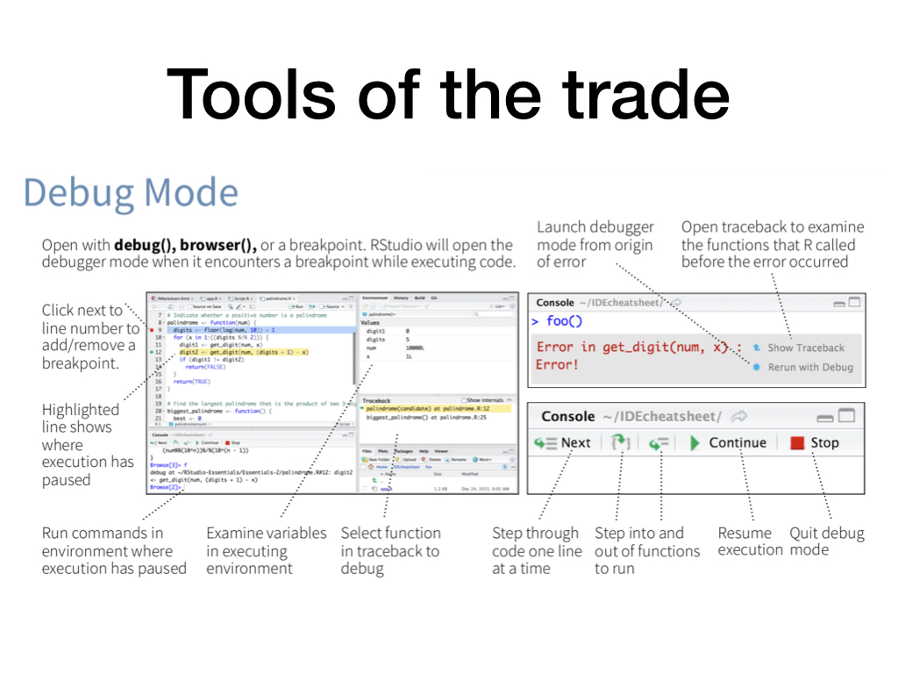

# RStudio Debugging Webinar

The R language has a collection of packages, functions, and tools that can be
used to help identify and diagnose errors in R code. The [RStudio
IDE](https://www.rstudio.com/products/rstudio/) provides easy access to many
these tools to make the process of debugging easier for the R developer. This
webinar highlights best practices for debugging R code in RStudio.

The data used in this webinar comes from
[opendata.utah.gov](https://opendata.utah.gov/Health/HCAHPS-Hospital-Ratings-For-Utah/a9vm-dqxv)
and contains hospital ratings data for hospitals in Utah.

## Additional Resources
:page_facing_up:[RStudio IDE Cheat Sheet](https://www.rstudio.com/resources/cheatsheets/#ide)  
:page_facing_up:[Debugging with RStudio](https://support.rstudio.com/hc/en-us/articles/205612627-Debugging-with-RStudio)  
:movie_camera:[Debugging techniques in RStudio (rstudio::conf 2018) - Amanda Gadrow](https://resources.rstudio.com/rstudio-conf-2018/debugging-techniques-in-rstudio-amanda-gadrow)  
:blue_book:[Debugging (Advanced R)](https://adv-r.hadley.nz/debugging.html)  
